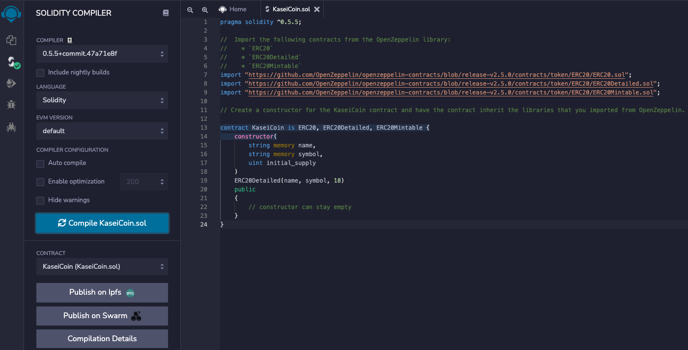
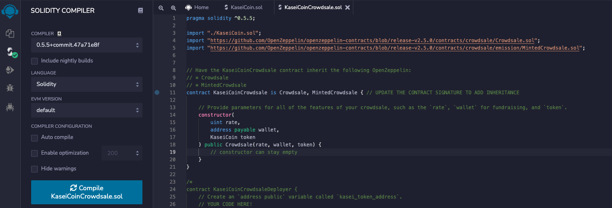
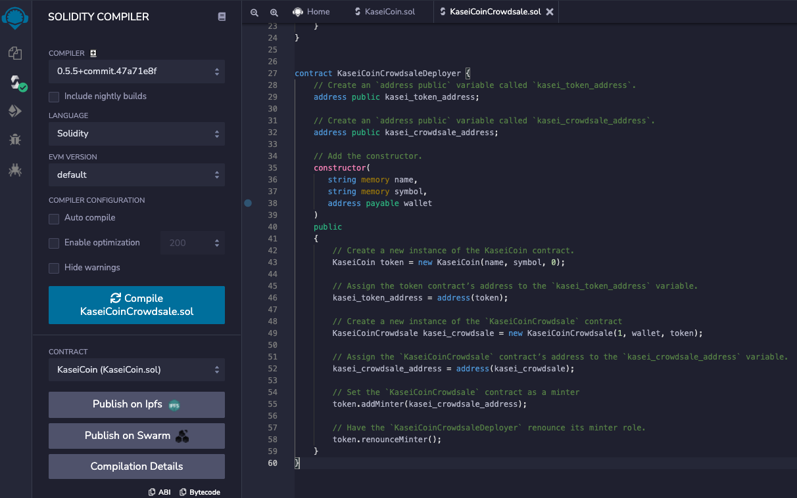

# Token Crowdsale

# Description

For this project, I am tasked with developing a monetary system for a new Mars colony by creating a KaseiCoin token contract, a KaseiCoin crowdsale contract and a KaseiCoin deployer contract. For testing, I have deployed on a local blockchain via Ganache. KaseiCoin is a fungible token and is ERC-20 compliant. The purpose of this crowdsale is to convert earthling money to KaseiCoin.

# KaseiCoin Demo

To review the functionality of the Kaseicoin crowdsale, see `KaseiCoinDemo.mov` in this repository. The demonstration completes the following steps:

1. Deploy the crowdsale to a local blockchain by using Remix, MetaMask, and Ganache.

2. Test the functionality of the crowdsale by using test accounts to buy new tokens and then checking the balances of those accounts.

3. Review the total supply of minted tokens and the amount of wei that the crowdsale contract has raised.

# Evaluation Results

## KaseiCoin Contract Compiled

## KaseiCoin Crowdsale Contract Compiled

## KaseiCoin Deployer Contract Compiled

