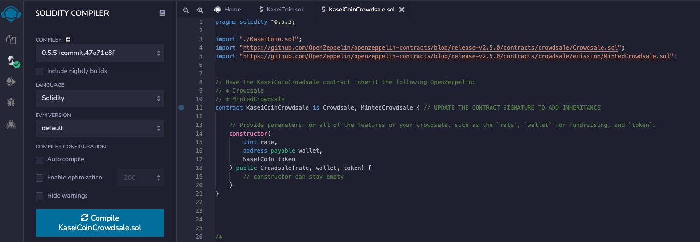

# Token Crowdsale

# Description

For this project, I am tasked with developing a monetary system for a new Mars colony by creating a KaseiCoin token contract, a KaseiCoin crowdsale contract and a KaseiCoin deployer contract. For testing, I have deployed on a local blockchain via Ganache. KaseiCoin is a fungible token and is ERC-20 compliant. The purpose of this crowdsale is to convert earthling money to KaseiCoin.

# KaseiCoin Demo

To review the functionality of the Kaseicoin crowdsale see KaseiCoinDemo.mov in this repository.

# Evaluation Results

## KaseiCoin Contract Compiled

## KaseiCoin Crowdsale Contract Compiled

## KaseiCoin Deployer Contract Compiled

