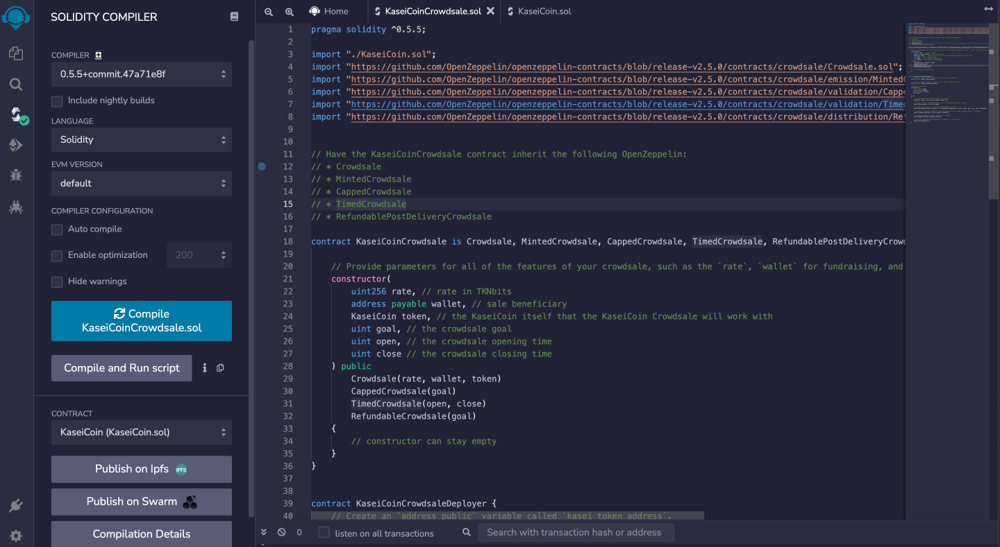

# Token Crowdsale

# Description

For this project, I am tasked with developing a monetary system for a new Mars colony by creating a KaseiCoin token contract, a KaseiCoin crowdsale contract and a KaseiCoin deployer contract. For testing, I have deployed on a local blockchain via Ganache. KaseiCoin is a fungible token and is ERC-20 compliant. The purpose of this crowdsale is to convert earthling money to KaseiCoin.

For this project, I have developed two `KaseiCoinCrowdsale.sol` versions. One for basic functionality (see [commit 6](https://github.com/tyedem/Token-Crowdsale/tree/b05ba37ece022b0d700dd74b13ceb75cab12fdf3)) and another extended version for timed crowdsales (see [commit 12](https://github.com/tyedem/Token-Crowdsale/tree/d9c9578f846866c3b97aa7ecdc05883afa58197b)).

# Basic KaseiCoin Crowdsale Demo

To review the functionality of the basic Kaseicoin crowdsale, see `KaseiCoinCrowdsaleDemo.mov` in this repository. The demonstration completes the following steps:

1. Deploy the crowdsale to a local blockchain by using Remix, MetaMask, and Ganache.

2. Test the functionality of the crowdsale by using test accounts to buy new tokens and then checking the balances of those accounts.

3. Review the total supply of minted tokens and the amount of wei that the crowdsale contract has raised.

# KaseiCoin Timed Crowdsale Demo

To review the functionality of the Kaseicoin timed crowdsale, see `KaseiCoinTimedCrowdsaleDemo.mov` in this repository. The demonstration completes the following steps:

1. Send ether to the crowdsale from a different account.

2. Set the `close` time to `now + 2 minutes`.

3. Finalize the sale by using the `finalize` function of the `Crowdsale` contract. When sending ether to the contract, it is important that it meets the `goal` of the contract. Note that to finalize the sale, `isOpen` must return false (`isOpen` comes from `TimedCrowdsale` and checks whether the `close` time has passed).

4. Review tokens in MetaMask.

# KaseiCoin Crowdsale Evaluation Results

## KaseiCoin Contract Compiled

## KaseiCoin Crowdsale Contract Compiled

## KaseiCoin Deployer Contract Compiled

## Timed KaseiCoin Crowdsale Contract Compiled

